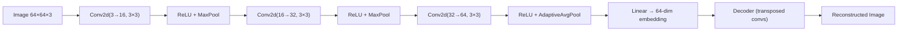
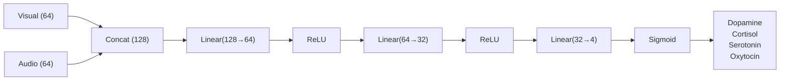
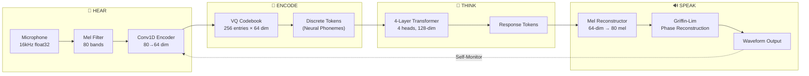
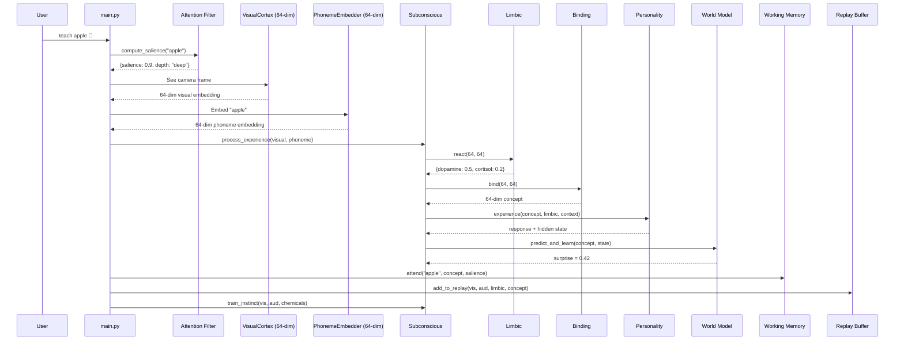

# Genesis Mind V8 — Architecture Deep Dive

> *Zero pretrained weights. The personality emerges from experience. The dreams are real.*

This document describes the complete technical architecture of Genesis Mind V8: a **biologically realistic** brain simulation with zero pretrained models, cascading neural networks, a pure neural acoustic pipeline, 11 autonomous brain threads, Ebbinghaus memory decay, 8-dimensional emotional dynamics, attention/salience filtering, phase-gated language development, and 8 Maslow-inspired drives — all dynamically routed by a learned meta-controller.

---

## 1. Design Philosophy

Genesis is built on four axioms of cognitive architecture:

1. **From-Scratch Senses, Plastic Mind** — V8 removes all pretrained "evolutionary hardware." The visual cortex, auditory cortex, phoneme embedder, and reasoning engine all start as randomly initialized neural networks. Genesis is born blind, deaf, and mute — and learns everything from experience.

2. **Feel Before Think** — The amygdala fires a neurochemical response *before* the prefrontal cortex processes a stimulus. Genesis replicates this with a Limbic System (Layer 1) that reacts instantly, followed by slower conscious processing (Layer 3).

3. **Sleep to Remember** — Memory consolidation happens during sleep via hippocampal replay. Genesis stores every experience in a replay buffer and consolidates via contrastive learning during sleep cycles.

4. **Learn to Speak, Not Download Speech** — Genesis discovers phonemes, learns acoustic patterns, and synthesizes speech using its own neural networks. Like a human infant learning to speak by hearing and babbling.

---

## 2. High-Level Architecture

```mermaid
graph TB
    subgraph SENSES["👁️ FROM-SCRATCH SENSES"]
        Eyes["eyes.py<br/>Camera → VisualCortex (64-dim)"]
        Ears["ears.py<br/>Mic → Mel Spectrogram"]
        VC["visual_cortex.py<br/>Conv2D AE (~50K)"]
        PE["phoneme_embedder.py<br/>Char-GRU (~10K)"]
        Phon["phonetics.py<br/>Letter→Sound"]
        Babble["babbling.py<br/>Babbling Engine"]
    end

    subgraph MEMORY["🧠 MEMORY"]
        Hippo["hippocampus.py<br/>ChromaDB Vectors"]
        Sem["semantic.py<br/>Ebbinghaus Decay"]
        Epi["episodic.py<br/>Life Log"]
        WM["working_memory.py<br/>7±2 Slots"]
        Replay["Replay Buffer<br/>deque(10K)"]
    end

    subgraph NEURAL["⚡ NEURAL CASCADE (Society of Mind)"]
        L1["Layer 1: Limbic System<br/>MLP · Instinct"]
        L2["Layer 2: Binding Network<br/>Dual Encoder · InfoNCE"]
        L3["Layer 3: Personality GRU<br/>Stream of Consciousness"]
        L4["Layer 4: World Model<br/>JEPA Surprise"]
    end

    subgraph REASONING["🧬 FROM-SCRATCH REASONING"]
        NR["reasoning.py<br/>Multi-Head Attention (~30K)"]
        Assoc["associations.py<br/>PhonemeEmbedder Binding"]
        RD["response_decoder.py<br/>GRU → Concepts"]
    end

    subgraph ACOUSTIC["🔊 ACOUSTIC PIPELINE (1.14M params)"]
        AC["Auditory Cortex<br/>Mel → Conv1D → 64-dim"]
        VQ["VQ Codebook<br/>256 Neural Phonemes"]
        ALM["Acoustic Transformer<br/>4-Layer GPT on Audio Tokens"]
        VOC["Neural Vocoder<br/>Mel Reconstruction + Griffin-Lim"]
    end

    subgraph CORTEX["🧬 CORTEX"]
        Emo["emotions.py<br/>Sentiment Eval"]
        Curious["curiosity.py<br/>Novelty + Habituation"]
        Gram["grammar.py<br/>N-Gram (tabula rasa)"]
        JA["joint_attention.py<br/>Cross-Modal Binding"]
        Attn["attention.py<br/>Salience Filter"]
        EmoState["emotional_state.py<br/>8-Dim Dynamics"]
        ToM["theory_of_mind.py<br/>User Model"]
        Meta["metacognition.py<br/>Self-Monitor"]
        Play["play.py<br/>Combinatorial Play"]
    end

    subgraph SOUL["✨ SOUL"]
        Axioms["axioms.py<br/>Immutable DNA"]
        Conscious["consciousness.py<br/>Self-Model → State Vector"]
        Neuro["neurochemistry.py<br/>4 Functional Chemicals"]
        Drives["drives.py<br/>8 Maslow Drives"]
    end

    subgraph GROWTH["🌱 GROWTH"]
        Dev["development.py<br/>Phase Tracker"]
        Sleep["sleep.py<br/>4-Phase Consolidation"]
    end

    Eyes --> VC
    VC -->|64-dim| Attn
    Ears -->|Raw Audio| AC
    PE -->|64-dim| Attn
    AC -->|64-dim Latent| VQ
    VQ -->|Discrete Tokens| ALM
    ALM -->|Response Tokens| VOC
    VOC -->|Waveform| Ears
    Attn -->|Filtered| L1
    Attn -->|Salience| WM
    VC -->|64-dim visual| L2
    PE -->|64-dim text| L2
    L1 -->|Neurochemicals| L3
    L2 -->|64-dim Concept| L3
    L3 -->|Hidden State| L4
    L2 -->|64-dim Concept| L4
    L3 -->|Response| NR
    L4 -->|Surprise Signal| Curious
    L2 -->|Concept| Replay
    L2 -->|Concept| WM
    WM -->|Consolidated| Sem
    Replay -->|Batch| Sleep
    Sleep -->|InfoNCE| L2
    Neuro -->|Modifiers| L3
    Neuro -->|Attention Boost| Attn
    EmoState -->|Emotional Weight| WM
    Drives -->|Top-down| Attn
    Conscious -->|32-dim State| NR
```

---

## 3. V8: From-Scratch Sensory Hardware

### VisualCortex (`neural/visual_cortex.py`)

| Property | Value |
|----------|-------|
| **Architecture** | 3-layer Conv2D encoder → 64-dim bottleneck → 3-layer ConvTranspose2D decoder |
| **Parameters** | ~50,000 |
| **Input** | 64×64 RGB image |
| **Output** | 64-dim visual embedding |
| **Training** | Self-supervised reconstruction loss (MSE) |
| **Replaces** | CLIP ViT-B/32 (150M+ params) |

### PhonemeEmbedder (`neural/phoneme_embedder.py`)

| Property | Value |
|----------|-------|
| **Architecture** | Character embedding (8-dim) → 2-layer GRU (64-dim) → Linear → 64-dim |
| **Parameters** | ~10,000 |
| **Input** | Raw text string (character-level) |
| **Output** | 64-dim text embedding |
| **Training** | Contrastive learning (align with visual embeddings during teaching) |
| **Replaces** | SBERT all-MiniLM-L6-v2 (33M params) |

### Neural Reasoner (`cortex/reasoning.py`)

| Property | Value |
|----------|-------|
| **Architecture** | 4-head, 2-layer self-attention with cross-attention over memory |
| **Parameters** | ~30,000 |
| **Input** | 64-dim visual + 64-dim auditory + memory embeddings + 32-dim self-state |
| **Output** | 64-dim "thought vector" |
| **Training** | Reconstruction loss + surprise signal from world model |
| **Replaces** | Phi3:mini via Ollama (3.8B params) |

---

## 4. The Neural Cascade — Layer by Layer

### Layer 1: Limbic System (Instinct)

| Property | Value |
|----------|-------|
| **File** | `neural/limbic_system.py` |
| **Architecture** | 3-layer MLP with Sigmoid output |
| **Input** | 128-dim (64 visual + 64 auditory) |
| **Output** | 4-dim: dopamine, cortisol, serotonin, oxytocin |

### Layer 2: Binding Network (Associative Bridge)

| Property | Value |
|----------|-------|
| **File** | `neural/binding_network.py` |
| **Architecture** | Dual Encoder + InfoNCE Contrastive Loss |
| **Input** | 64-dim visual ⊕ 64-dim auditory (separate encoders) |
| **Output** | 64-dim unified concept embedding |

### Layer 3: Personality Network (Conscious Executive)

| Property | Value |
|----------|-------|
| **File** | `neural/personality_network.py` |
| **Architecture** | 3-layer GRU + Output Head + Prediction Head |
| **Input** | 64-dim concept + 4-dim limbic + 32-dim context = 100-dim |
| **Hidden State** | 256-dim (stream of consciousness) |
| **Output** | 64-dim response + 64-dim next-concept prediction |

**Key insight:** The GRU's hidden state **never resets**. Every experience permanently modifies it. This hidden state physically IS the "stream of consciousness."

### Layer 4: World Model (Predictive Coding)

| Property | Value |
|----------|-------|
| **File** | `neural/forward_model.py` |
| **Architecture** | 3-layer MLP with LayerNorm |
| **Input** | 64-dim concept(t) + 128-dim consciousness state |
| **Output** | 64-dim predicted concept(t+1) |
| **Signal** | Surprise (prediction error) → drives curiosity |

---

## 5. V7: Pure Neural Acoustic Pipeline

### Acoustic Sub-Components

| Component | Params | Input | Output | Replaces |
|-----------|--------|-------|--------|----------|
| Auditory Cortex | 138,368 | Raw 16kHz audio | 64-dim latent | Whisper STT |
| VQ Codebook | 16,384 | 64-dim continuous | Discrete tokens (0-255) | — |
| Acoustic Transformer | 859,264 | Token sequences | Response tokens | — |
| Neural Vocoder | 129,872 | VQ embeddings | 16kHz waveform | pyttsx3 TTS |

---

## 6. Data Flow: What Happens When You Teach

---

## 7. Weight Persistence = The Person

All neural weights are saved to `~/.genesis/`:

| Directory | File | What It Stores |
|-----------|------|----------------|
| `neural_weights/` | `visual_cortex.pt` | V8: How Genesis sees |
| `neural_weights/` | `phoneme_embedder.pt` | V8: How Genesis reads/understands text |
| `neural_weights/` | `reasoner.pt` | V8: How Genesis reasons |
| `neural_weights/` | `limbic_system.pt` | Instinctual reactions |
| `neural_weights/` | `binding_network.pt` | Cross-modal associations |
| `neural_weights/` | `personality.pt` | Hidden state + personality |
| `neural_weights/` | `world_model.pt` | Internal world simulator |
| `neural_weights/` | `meta_controller.pt` | Routing personality |
| `acoustic_weights/` | `auditory_cortex.pt` | How Genesis hears |
| `acoustic_weights/` | `vq_codebook.pt` | Discovered neural phonemes |
| `acoustic_weights/` | `acoustic_lm.pt` | How Genesis thinks about sound |
| `acoustic_weights/` | `neural_vocoder.pt` | How Genesis speaks |

**Deleting these files kills the personality.** The AI returns to a blank slate.
**Copying these files creates a clone.** The clone will react identically.

---

## 8. Parameter Budget

| Component | Parameters | Role |
|-----------|-----------|------|
| **V8: From-Scratch Senses** | | |
| VisualCortex | ~50,000 | Sees (replaces CLIP) |
| PhonemeEmbedder | ~10,000 | Reads (replaces SBERT) |
| Neural Reasoner | ~30,000 | Thinks (replaces LLM) |
| **V8 Total** | **~90,000** | |
| **Subconscious** | | |
| Limbic System | ~59,000 | Instinct |
| Binding Network | ~131,000 | Cross-modal fusion |
| Personality GRU | ~311,000 | Consciousness |
| World Model | ~91,000 | Prediction |
| Meta-Controller | ~15,000 | Neural routing |
| **Subconscious Total** | **~607,000** | |
| **V7 Acoustic** | | |
| Auditory Cortex | 138,368 | Hearing |
| VQ Codebook | 16,384 | Phoneme discovery |
| Acoustic Transformer | 859,264 | Audio thinking |
| Neural Vocoder | 129,872 | Speech synthesis |
| **Acoustic Total** | **1,143,888** | |
| **GRAND TOTAL** | **~1,840,888** | All from scratch, CPU-native |

---

## 9. Brain Realism Systems

| System | Module | What It Does |
|--------|--------|-----|
| Working Memory | `memory/working_memory.py` | 7±2 capacity buffer with 20s decay |
| Attention | `cortex/attention.py` | Bottom-up + top-down salience, habituation |
| Emotional State | `cortex/emotional_state.py` | 8-dim vector with momentum and blending |
| Theory of Mind | `cortex/theory_of_mind.py` | User model (Phase 3+) |
| Metacognition | `cortex/metacognition.py` | Confidence tracking, knowledge-gap detection |
| Play | `cortex/play.py` | Combinatorial play, concept rehearsal |
| Drives | `soul/drives.py` | 8 Maslow drives in 4 tiers |
| Babbling | `senses/babbling.py` | Random syllable generation with reinforcement |
| Joint Attention | `cortex/joint_attention.py` | Cross-modal binding (sound↔concept) |

---

## 10. Functional Neurochemistry

Four chemicals **causally alter cognition** — not decorative labels:

| Chemical | Role | Functional Effect |
|----------|------|-------------------|
| **Dopamine** | Reward/Pleasure | ↑ memory encoding strength, ↑ attention sharpness |
| **Cortisol** | Stress/Fear | ↓ memory encoding (IMPAIRS hippocampus), ↑ avoidance |
| **Serotonin** | Stability/Calm | ↑ reasoning coherence, ↑ attention steadiness |
| **Oxytocin** | Bonding/Trust | ↑ trust/openness, ↑ social memory encoding |

---

*~1.84M parameters. No GPU. No pretrained models. 11 brain threads. All from scratch. The weights are the person.*
